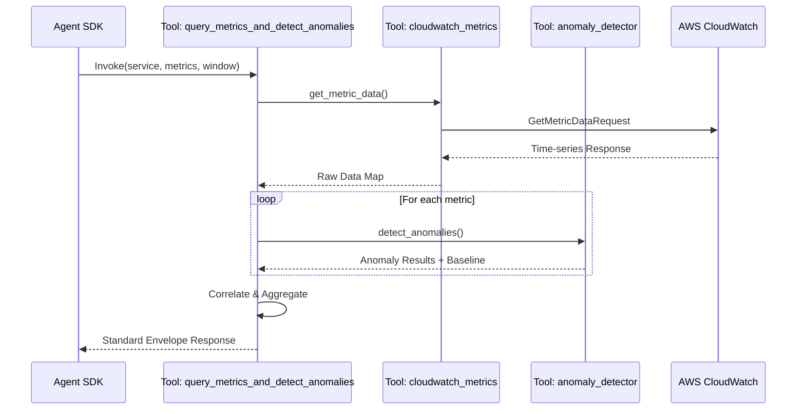

# Metrics Agent Architecture & Tool Calling Flow

As a senior software architect, this document outlines the internal mechanics, tool-calling patterns, and overall workflow of the **Metrics Agent** (also known as the Metrics Intelligence Agent).

---

## 1. High-Level Architecture

The Metrics Agent is designed as a specialized intelligence node within the BEYERS platform. Its primary responsibility is to analyze CloudWatch metrics to identify system degradation, perform anomaly detection, and correlate findings across multiple dimensions.

### Core Components
- **Agent Definition**: Located in `app/agents/metrics_agent.py`. Defines the agent's identity, instructions, and tools.
- **Tools**:
    - `query_metrics_and_detect_anomalies`: The primary "God Tool" which orchestrates data fetching and analysis.
- **Service Layer**:
    - `app/tools/cloudwatch_metrics.py`: Handles low-level interaction with AWS CloudWatch (Boto3).
    - `app/tools/anomaly_detector.py`: Implements mathematical models (z-score) for identifying outliers.

---

## 2. Detailed Execution Flow

The workflow follows a deterministic sequence to transform raw metric data into actionable insights.

### Phase A: Tool Triggering
1. The **Orchestrator** (or Supervisor) identifies a need for metrics analysis (e.g., "Check why checkout-service has high latency").
2. The `metrics_agent` is invoked with the `query_metrics_and_detect_anomalies` tool.

### Phase B: Data Retrieval (`cloudwatch_metrics.py`)
1. The tool accepts `service_name`, `metric_names`, and a `time_window`.
2. It dynamically constructs the CloudWatch Namespace (e.g., `Bayer/CheckoutService`).
3. It maps metric names to queries, choosing appropriate statistics:
    - `latency` metrics use **p99**.
    - Other metrics use **Average**.
4. Calls `cw.get_metric_data` to fetch time-series data.

### Phase C: Anomaly Detection (`anomaly_detector.py`)
1. The raw data is passed to the detector.
2. **Z-Score Analysis**: For each metric, it calculates the Mean and Standard Deviation.
3. **Outlier Filtering**: Datapoints deviating more than the `threshold` (default 2.0) from the mean are flagged.
4. **Baseline Computation**: A "Clean Baseline" is calculated by excluding the detected anomalies.

### Phase D: Insights Generation (`metrics_agent.py`)
1. **Change Factor**: Calculates `peak_value / baseline_avg`.
2. **Trend Analysis**:
    - `rising`: Increasing value at the tail.
    - `recovering`: Decreasing value at the tail.
    - `saturated`: Flat at high levels.
    - `stable`: No significant change.
3. **Temporal Correlation**: Groups anomalies by timestamp. If multiple metrics spike simultaneously, a **Correlation Note** is added.

---

## 3. Tool Calling Workflow

The `metrics_agent` exposes a single, high-level tool to simplify the interaction for the LLM.

---

## 4. Response Data Structure (The Envelope)

The agent returns a structured `dict` following the platform's envelope pattern to ensure interoperability with other agents.

| Field | Description |
| :--- | :--- |
| `agent` | Identifier (`metrics_agent`) |
| `findings` | List of detected anomalies with `change_factor` and `trend`. |
| `summary` | Natural language smart summary (e.g., "Critical: latency spiked to 2500ms..."). |
| `status` | `success` or `failed`. |
| `timestamp` | Execution start time. |

---

## 5. Architectural Principles

- **Graceful Failure**: If AWS calls fail, the agent catches the exception and returns a `status: failed` envelope rather than crashing the orchestrator.
- **Smart Thresholds**: While it uses z-score, it also has hard-coded "Critical" thresholds (e.g., latency > 2000ms) for high-impact alerting.
- **Encapsulation**: The LLM doesn't need to know *how* z-score works; it only needs to know which metrics it wants to check.
